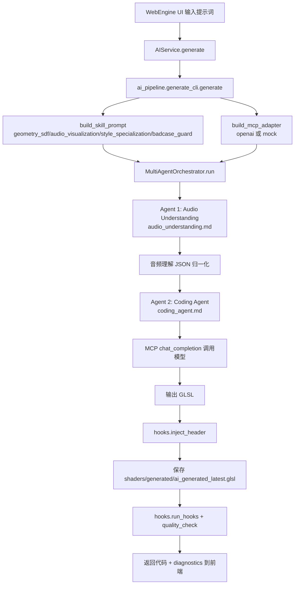
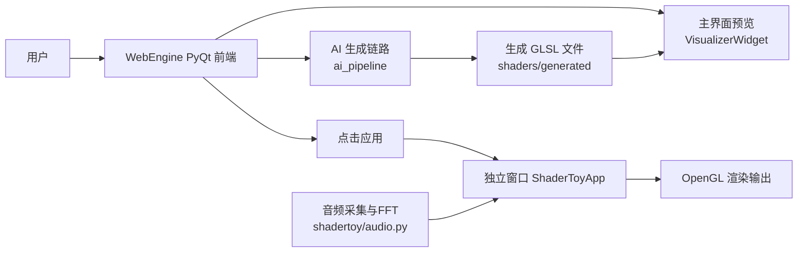

# MusicShader

基于 Python + OpenGL 的 ShaderToy 风格运行时，包含音频可视化渲染与 AI 着色器生成链路（MCP + Skills + 多 Agent）。

https://github.com/user-attachments/assets/b93a76da-2f85-4ab0-b9a9-4ba65548fbd1


## 项目结构

- `shadertoy/`：渲染运行时、音频采集与 FFT、ShaderToy uniform 管理。
- `shaders/`：GLSL 着色器资源（含 `generated/`、`AI_shaders/`、`_preview/`）。
- `WebEngine/`：PyQt 前端界面、AI 对话入口、预览与应用窗口启动。
- `ai_pipeline/`：AI 生成流程（skills、MCP 协议适配、多 Agent 编排、hooks 质检）。
- `prompts/`：提示词模板资源。

## 环境准备

### 一键创建 conda 环境（推荐）

```powershell
conda env create -f environment.yml
conda activate chuyan
```

这会自动安装 Python 3.11、ffmpeg 及 `requirements.txt` 中所有 Python 依赖。

> 如果已有 conda 环境仅需更新依赖：`conda env update -f environment.yml`

### 手动安装（不依赖 conda）

如果不用 conda，需自行确保 ffmpeg 已安装并在 PATH 中：

```powershell
python -m pip install -r requirements.txt
```

ffmpeg 可通过以下方式之一安装：
- **Chocolatey**: `choco install ffmpeg`
- **Scoop**: `scoop install ffmpeg`
- **官网下载**: https://ffmpeg.org/download.html（手动添加到 PATH）

## 运行方式

```powershell
python -m shadertoy
```

加载指定着色器：

```powershell
python -m shadertoy shaders/audio_viz.glsl
```

启动 PyQt 前端：

```powershell
python WebEngine/app.py
```

## 手势交互

当前已接入 MediaPipe 手势识别，并支持主窗口与 borderless 窗口共享同一份手势结果。

- 手势数据由主进程侧的摄像头采集并统一发布，外部窗口通过本地命名管道订阅，不再重复占用摄像头。
- 运行时会优先使用仓库内固定路径的本地模型文件 `shadertoy/assets/hand_landmarker.task`，避免自动联网下载。
- Shader 可读取新增 uniform：`iHandPos` 和 `iHandAction`，用于实现手势焦点与捏合强度联动。
- 如需覆盖模型路径，可设置环境变量 `SHADERTOY_HAND_LANDMARKER_MODEL` 指向本地 `.task` 文件。
- 如需覆盖命名管道名称，可设置环境变量 `SHADERTOY_GESTURE_PIPE`。

推荐的验证方式：

```powershell
python WebEngine/app.py
```

随后从主界面启动 borderless 预览，确认两个窗口都能随同一份手势输入变化。

## 关键决策（音频输入到 AI）

经评估，`实时音频 -> AI 实时生成` 当前不采用，原因如下：

- 实时请求会显著增加用户等待时间，影响交互体验。
- 实时链路会引入更多抖动与不确定性，不利于生成稳定性。

当前采用策略：

- AI 生成阶段使用离线/摘要化音频特征（可由文件或预计算结果提供）。
- 实时音频主要用于渲染阶段驱动（Shader 运行时动态响应），而不是每帧触发 AI 生成。

## AI 音频着色器生成流程图（含 MCP / Skills / 多 Agent）



## 整体系统流程图



## 说明

- 生成链路支持 `openai` 与 `mock` provider，按环境变量自动选择。
- 会话上下文保存在 `ai_pipeline/conversations.json`，用于多轮连续生成。
- 质量检查目前以结构与关键符号为主，可继续扩展为编译级与回归级检查。

## 未完成与需改进部分

1. 主预览音频驱动链路需补强  
   当前主界面预览对音频纹理更新的持续性与稳定性仍需完善，需确保音频驱动 Shader 在预览窗口中可稳定复现。

2. 通道语义需要统一与文档化  
   需统一 `iChannel0/iChannel1` 的时域与频域分工，并同步更新 `coding_agent.md`、示例 Shader 与运行时实现，避免“预览/应用”不一致。

3. 质量检查深度不足  
   当前以关键符号检查为主，缺少编译级验证、性能预算检查、badcase 自动回归与基线对比。

4. 可观测性不足  
   UI 侧尚未完整展示多 Agent 中间结果（音频分析 JSON、技能注入、诊断信息、质量报告），排障成本较高。

5. 工程收敛与编码一致性  
   旧入口与新入口并存，部分文件存在中文乱码，需统一 UTF-8 编码并明确 deprecated 模块范围。

6. 运行容错与降级提示  
   音频 loopback 不可用、模型调用失败等场景下，前端提示与自动降级路径需要更清晰。

## 项目任务排期（6 周）

> 起始时间按 2026-05-06 计，可按实际迭代节奏顺延。

### 第 1 周（2026-05-06 ~ 2026-05-12）：预览链路稳定化

- 完成 `WebEngine` 主预览窗口的音频纹理持续更新闭环。
- 增加预览链路日志与错误提示（初始化失败、纹理更新失败、编译失败）。
- 验收标准：默认 Shader 与至少 2 个音频驱动 Shader 在主预览中稳定响应。

### 第 2 周（2026-05-13 ~ 2026-05-19）：通道语义统一

- 确认并固化通道规范（建议：`iChannel0=FFT`，`iChannel1=时域`，或反之）。
- 同步更新运行时代码、AI 编码 SOP、示例 Shader 与 README。
- 验收标准：同一 Shader 在主预览和独立应用窗口视觉行为一致。

### 第 3 周（2026-05-20 ~ 2026-05-26）：质量门禁升级

- 增加 GLSL 编译级检查（最小可编译验证）。
- 扩展 hooks：采样越界风险扫描、复杂度/长度阈值检查。
- 接入 `ai_pipeline/cases` 的 goodcase/badcase 批量回归。
- 验收标准：新增门禁能拦截已知 badcase，且不误杀基线 goodcase。

### 第 4 周（2026-05-27 ~ 2026-06-02）：可观测性建设

- 在 UI 中展示生成链路关键节点信息：provider/model、audio 分析、skills 注入、multi-agent 诊断、quality 结果。
- 增加“导出诊断包”能力，便于问题复现。
- 验收标准：任一生成失败都能在 UI 中快速定位到失败阶段。

### 第 5 周（2026-06-03 ~ 2026-06-09）：语音输入与跨端交互（非桌面端）

- 新增语音输入链路：语音采集 -> 语音识别（ASR）-> 提示词注入 -> AI 生成。
- 支持交互模式切换：文本输入 / 语音输入 / 混合输入。
- 增加移动端与触控端适配能力（最小功能集）：
  - 大按钮与触控友好布局
  - 基础响应式页面（窄屏布局）
  - 低带宽与高延迟场景的状态反馈
- 非桌面端接入方案：
  - 以 Web 前端/轻量 H5 作为交互入口
  - 后端复用现有 `ai_pipeline` 与渲染服务接口
- 验收标准：
  - 在手机或平板浏览器完成“语音描述 -> 生成 Shader -> 查看结果”闭环
  - 识别失败与网络波动场景有明确提示与重试入口

### 第 6 周（2026-06-10 ~ 2026-06-16）：容错与工程收口

- 优化 OpenAI/MCP 调用重试、超时与降级策略（失败自动回退 mock 并提示）。
- 优化会话持久化健壮性（原子写、损坏恢复策略）。
- 完善音频设备不可用时的前端提示与降级渲染行为。
- 清理或下线旧实现入口（如 `app_old.py` 相关链路），减少分叉维护成本。
- 统一编码与文本规范，修复乱码问题。
- 补充维护文档：模块边界、流程说明、排障手册。
- 验收标准：断网/无音频设备场景下仍可完成可预期流程，且主链路唯一、文档与实现一致、可交接维护。
